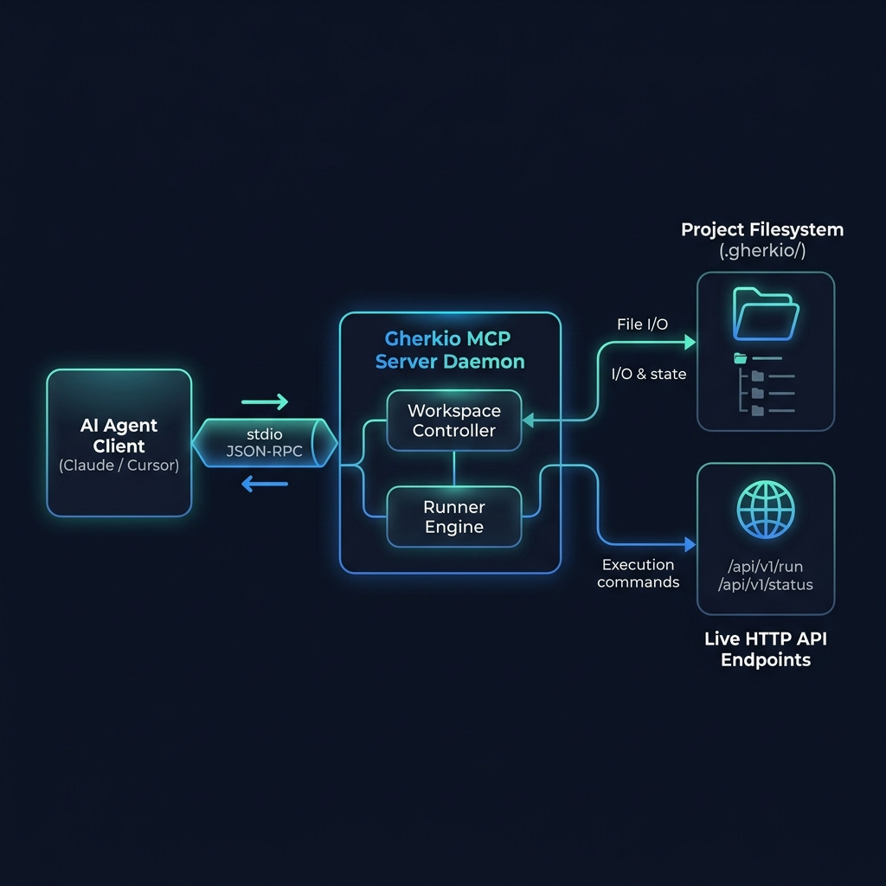

# Gherkio — Declarative Integration Testing Platform

<p align="center">
  
</p>

> **Write API integration tests in declarative YAML. No imperative boilerplates required.**

Gherkio is a state-of-the-art integration testing platform designed to orchestrate HTTP-based user journeys. Describe request sequences, extract variables, define rich assertions, and enforce security policies — all in a clean, self-documenting YAML DSL that stays readable after 2 years.

## What is Gherkio?

Gherkio is a declarative integration testing platform that lets you write API integration tests in pure YAML instead of imperative code. It compiles to a single static Go binary with zero external runtime dependencies, making it ideal for ephemeral CI environments, Docker containers, and air-gapped systems.

- **Declarative YAML DSL** — Describe what behavior to orchestrate, not how to implement it
- **Zero runtime dependencies** — Single static binary, no Node.js, Python, or JVM required
- **AI-ready** — Native MCP server for AI coding assistants
- **Enterprise security** — Outbound sandboxing, credential masking, SSRF prevention

---

## 🎯 The Gherkio Philosophy

Gherkio is built on a simple, uncompromising core principle:

> **Integration testing should describe *what* behavior to orchestrate, not *how* to implement it.**

*   **Declarative-First**: Scenarios describe high-level API workflows rather than writing hundreds of lines of custom Javascript/Go scripts.
*   **Readability Matters**: Integration tests are written to be easily read, audited, and maintained by anyone on the team (including Product Managers and QA).
*   **Deep Observability**: Every execution outputs high-precision terminal assertions and structured tracebacks so failures are debugged instantly.
*   **Constrained DSL**: No arbitrary loops or complex branching inside test files—forcing tests to stay clean, predictable, and robust.

---

## 📚 Developer Documentation Book

Gherkio features an extensive, production-grade **Developer Documentation Book (mdBook)** that covers all structural layers, detailed DSL syntax references, security guidelines, and real-world testing recipes:

*   **Progressive Onboarding**: Progress through our [Introduction](docs/book/src/getting-started/introduction.md), [2-Minute Quickstart](docs/book/src/getting-started/quickstart.md), [Tutorial](docs/book/src/getting-started/first-test-tutorial.md), and [Interactive Playground](docs/book/src/getting-started/playground.md).
*   **Deep DSL Reference**: Comprehensive specifications for [Assertions & Dot-Paths](docs/book/src/dsl/assertions.md), [Request Configuration](docs/book/src/dsl/requests.md), [Multipart Form Data](docs/book/src/dsl/requests.md#multipart-form-data-multipart), [Setup & Teardown](docs/book/src/dsl/setup-teardown.md), and [Retries](docs/book/src/dsl/retry.md).
*   **Variable Precedence & Dynamic Generators**: Details on time/date offsets, custom Go layout formatting, base64 encodes, and cryptographic SHA-256 HMAC validations in [Variables & Generators](docs/book/src/dsl/variables.md).
*   **Outbound Network Sandboxing**: In-depth explanations of SSRF prevention, DNS rebound protection, and network allowlists/blocklists in [Project & Security Setup](docs/book/src/getting-started/project-setup.md#🔒-security--sandboxing-policies).
*   **AI Integration & MCP Server**: Step-by-step connection guides for Claude Desktop, VS Code (Cline/Continue), Cursor, Neovim, JetBrains, and Zed in [Model Context Protocol](docs/book/src/mcp/overview.md).
*   **Frequently Asked Questions**: Quick answers to common questions about setup, credentials, CI/CD integration, and troubleshooting in the [FAQ](docs/book/src/reference/faq.md).

### Build and View Locally

To compile and browse the developer documentation locally:

```bash
# Generate Cobra CLI manual pages and compile mdBook
make docs-build

# Open the compiled HTML index in your browser
# (or double-click docs/book/book/index.html)
```

---

## 🎮 Interactive Browser Playground

To lower Gherkio's learning curve to zero, Gherkio includes a self-contained, browser-based **Interactive Playground and Documentation Hub** located under `docs/book/playground/index.html`.

*   **Visual DSL Stepper**: Type or edit Gherkio YAML test steps and see a live graphical flowchart built on the fly!
*   **cURL-to-YAML Step Translator**: Paste standard legacy cURL statements and get back perfectly compiled Gherkio steps instantly.

#### Launch it instantly:
*   **Online Sandbox**: Access the hosted web workspace directly on **[GitHub Pages Playground](https://muhfaris.github.io/gherkio/playground/index.html)**.
*   **Local Launch**: Double-click [docs/book/playground/index.html](docs/book/playground/index.html) to run it in your browser offline, or open it via terminal:
    ```bash
    # Linux
    xdg-open docs/book/playground/index.html

    # macOS
    open docs/book/playground/index.html
    ```

---

## ⚡ Core Features

*   **Declarative YAML DSL** — Describe test scenarios, not implementation. Scenarios double as live, executable documentation readable by engineers, QA, and product managers.
*   **HTTP Request Execution** — POST, GET, PUT, DELETE, PATCH with full header/body support, multipart uploads, and automatic MIME detection.
*   **Rich Assertion Engine** — 30+ built-in matchers including status codes, field types (`uuid`, `email`, `datetime`, `uri`), list lengths, existence checks, and negative assertions.
*   **JWT Auto-Decoding** — Automatically decode and assert claims from response tokens (`jwt.role: admin`) without writing custom parser code.
*   **Scenario Composition** — Reuse existing scenarios as steps with `use:` for clean, DRY orchestration across test suites.
*   **Request Retries** — Handle eventual consistency with configurable intervals, exponential backoff, and status-based exit conditions.
*   **Outbound Sandboxing (SSRF Prevention)** — Restrict API connection scopes with wildcard domain maps, DNS-level loopback detection, and private subnet blocking.
*   **Sensitive Field Masking** — Automatically redact passwords, API keys, tokens, and authorization headers in all console and report outputs.
*   **Multi-Account Credentials** — Run the same test against multiple user accounts (`--account` / `--all-accounts`) without duplicating test files.
*   **Parallel Execution** — Accelerate feedback loops by executing tests concurrently with configurable concurrency (`-p <concurrency>`).
*   **Native MCP Server** — Built-in Model Context Protocol server for AI assistant integration with Cursor, Claude Desktop, Cline, and Copilot.
*   **cURL-to-YAML Conversion** — Translate legacy cURL statements into Gherkio YAML steps instantly via CLI or interactive playground.

---

## 🚀 3-Step Quick Start

### 1. Installation
Install Gherkio using our lightweight installer script:
```bash
curl -fsSL https://raw.githubusercontent.com/muhfaris/gherkio/main/install.sh | sudo bash
```

### 2. Scaffold a Project
Initialize Gherkio's canonical workspace layout:
```bash
gherkio init
```

### 3. Run the Scaffolded Test
Execute the auto-generated test scenario:
```bash
gherkio run example/auth/login.yaml -v
```

---

## 🤖 Built-in MCP Server (AI Integration)

Gherkio ships with a native **Model Context Protocol (MCP) server** over stdio. This lets AI coding assistants (like Cursor, Claude Desktop, Cline, and Copilot) read specifications, generate scenarios, validate structures, and run tests for you using natural language.

### Cursor Setup (`.cursor/mcp.json`)
```json
{
  "mcpServers": {
    "gherkio": {
      "command": "/usr/local/bin/gherkio",
      "args": ["mcp"]
    }
  }
}
```

*For Claude, Cline, Neovim, JetBrains, and Zed configurations, see the [Model Context Protocol Setup Guide](docs/book/src/mcp/setup.md).*

---

## 🤝 Development & Contributing

Prerequisites: **Go 1.25+**

```bash
git clone https://github.com/muhfaris/gherkio.git
cd gherkio

# Build the CLI
go build -o gherkio .

# Run all unit tests
go test ./...

# Regenerate console output golden snapshot files
go test ./internal/runner/ -update
```

*For detailed contribution guidelines, commit standards, and snapshot testing explanations, see the [Contributing Guide](docs/book/src/contributing/overview.md).*

---

## ❓ Frequently Asked Questions

### What makes Gherkio different from Postman or Bruno?
Postman and Bruno are GUI-centric API clients. Gherkio is a CLI-first integration testing platform designed for CI/CD pipelines. Tests are plain YAML files that live in your repository, execute deterministically, and produce structured reports — no GUI required, no vendor lock-in.

### Does Gherkio require Node.js, Python, or a JVM?
No. Gherkio is a single static Go binary with zero external runtime dependencies. It runs anywhere Go compiles — Linux, macOS, Windows, Docker, and even air-gapped environments.

### Can Gherkio work with existing CI/CD pipelines?
Yes. Gherkio produces exit codes, structured JSON reports, and machine-readable output that integrates with GitHub Actions, GitLab CI, Jenkins, CircleCI, and any POSIX-compatible pipeline.

### How does Gherkio handle authentication and credentials?
Gherkio supports multi-account credentials, environment variable injection, and automatic sensitive field masking. You can run the same test against admin, user, and read-only accounts simultaneously using `gherkio run --all-accounts`.

### Does Gherkio support GraphQL or gRPC?
Gherkio's HTTP engine supports any JSON-based API, including GraphQL endpoints. Native gRPC support is on the roadmap.

### Can AI assistants write Gherkio tests?
Yes. Gherkio ships with a native MCP server that lets AI coding assistants (Cursor, Claude Desktop, Cline, Copilot) read specifications, generate scenarios, validate structures, and run tests using natural language.

### How do I convert existing cURL commands to Gherkio YAML?
Use `gherkio convert --curl "curl -X POST https://api.example.com/login"` to instantly translate cURL statements into Gherkio YAML steps. The interactive playground also includes a cURL-to-YAML translator.

### What security features does Gherkio include?
Gherkio includes outbound network sandboxing (SSRF prevention), DNS-level loopback protection, sensitive field masking in console output, and credential isolation across accounts.

---

## 📄 License

[MIT](LICENSE) © 2026 Muhammad Faris
