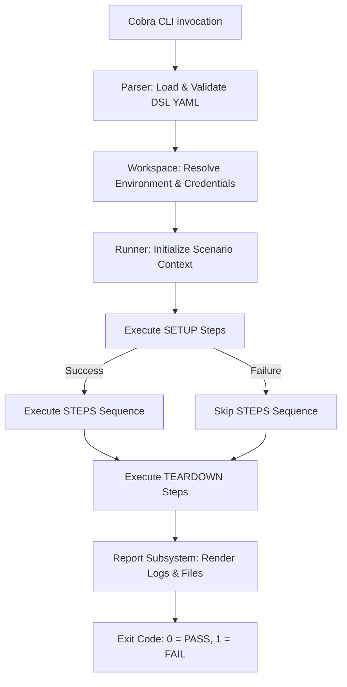

# Engine Architecture & System Design

> 🔴 **Expert & Platform Engineering Guide** — A deep-dive into Gherkio's static Go engine, package hierarchy, thread-safe execution pipeline, security sandboxing, and reporting subsystems.

---

## 📁 Core Package Hierarchy

Gherkio's codebase is designed in Go with strict decoupling, zero external runtime dependencies, and high execution speed:

- **`cmd/`**: CLI command interfaces powered by Cobra. Defines subcommands (`run`, `init`, `validate`, `convert`, `schema`, `mcp`).
- **`internal/parser/`**: Reads YAML Gherkio DSL files, performs syntactic structural parsing, checks schema validity, and compiles raw strings into Go AST structs.
- **`internal/runner/`**: The core execution state machine. Manages HTTP client connections, dynamic variable scopes (`$accounts`, `$env`, saved variables), timing budgets, and assertion evaluation.
- **`internal/matcher/`**: Evaluation engine for value matchers (`equal`, `contains`, `greaterThan`, `lessThan`, `oneOf`, `in`, `matchesRegex`, `jwt`, `schema`).
- **`internal/mcp/`**: Native JSON-RPC Model Context Protocol (MCP) server running on `stdio`, exposing 25+ tools and resources for AI assistant workflows.
- **`internal/report/`**: Compiles execution traces into console ANSI logs, JUnit XML, HTML interactive dashboards, and JSON files.

---

## ⚡ Step Execution & State Machine

The runner evaluates each scenario step using an isolated state machine:

---

## 🛡️ Outbound Network Security & SSRF Sandboxing

Gherkio features built-in Server-Side Request Forgery (SSRF) prevention sandboxing for safe execution in untrusted CI/CD pipelines:
* **IP Whitelisting / Blacklisting**: Inspects resolved IP addresses prior to TCP connection handshake.
* **Subnet Isolation**: Prevents test steps from probing internal cloud metadata endpoints (e.g. `169.254.169.254` or `127.0.0.1/8`) unless explicitly authorized in `.gherkio/config.yaml`.
* **Credential Redaction**: Intercepts terminal logging buffers and automatically sanitizes values from `$accounts` and authorization headers.

---

## 🏎️ Parallel Execution & Thread Safety

When running multiple scenarios concurrently via `gherkio run --parallel=4`:
* **Isolated Scenario Scopes**: Each scenario run maintains its own isolated memory map for saved variables (`save` block) and response buffers.
* **Stateless HTTP Client Pooling**: Shares TCP connections safely across worker goroutines while isolating TLS session states.
* **Thread-Safe Reporting**: Synchronizes stdout ANSI log printing and file output writers via mutex locking to guarantee clean, non-interleaved terminal logs.
