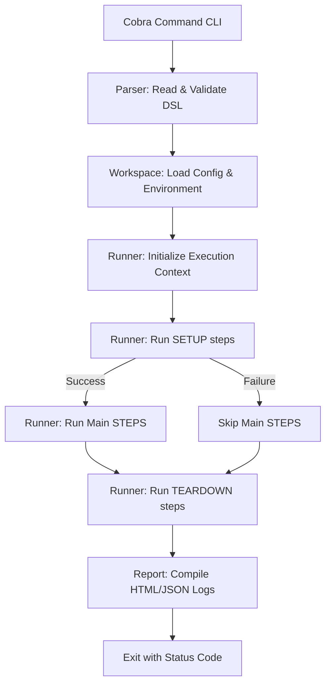

# Codebase Architecture

Understand Gherkio's package structures, compilation hierarchy, and execution control flows.

---

## 📁 Core Package Hierarchy

Gherkio's codebase is designed with modularity, strong decoupling, and easy testability in mind:

- **`cmd/`**: CLI command interfaces powered by Cobra. Each subcommand (e.g. `run`, `init`, `validate`) registers itself via Go package `init()` functions to the unexported root command.
- **`internal/parser/`**: Reads YAML Gherkio DSL files, performs syntactic structural parsing, checks schema validity, and compiles raw strings into Go struct schemas.
- **`internal/runner/`**: The core execution engine. Handles the sequence state machine, processes HTTP requests, manages dynamic variable interpolation, evaluates assertions against matchers, and prints terminal logs.
- **`internal/mcp/`**: A programmatic Model Context Protocol (MCP) server stdio wrapper, exposing parser, workspace, and runner capabilities directly to AI models.
- **`internal/report/`**: Generates and compiles HTML/JSON integration report assets.

---

## ⚡ Execution Control Flow

When a developer runs `gherkio run <file>`, the engine follows this linear sequence:

