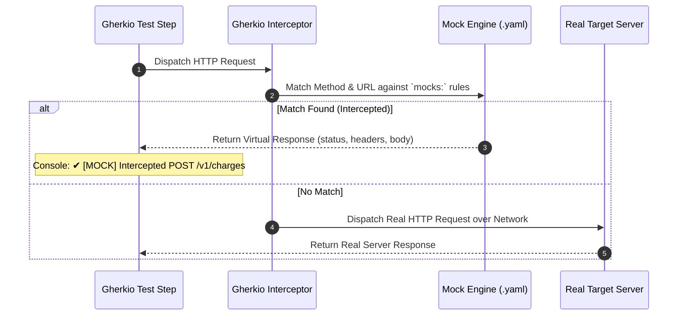

# 🎭 Service Mocking & Virtualization

In modern microservice ecosystems, test suites frequently depend on third-party APIs (e.g. Stripe, Twilio, AWS S3) or external microservices that may be unstable, rate-limited, or costly to call during automated CI/CD runs.

Gherkio includes a **native, in-process Service Virtualization & Request Interception Engine**. It allows you to mock any HTTP endpoint directly within your environment configuration (`.gherkio/environments/<env>.yaml`) without launching external proxy servers like WireMock or Mountebank.

---

## ⚙️ How Mock Interception Works

When a test step executes an HTTP `request`, Gherkio's runner checks the target environment's `mocks:` array **before** dispatching a real network request over the wire:



---

## 📝 Defining Mocks in Environment YAML

Mocks are defined at the environment level inside `.gherkio/environments/<env>.yaml`. This ensures test scenarios remain clean and declarative while enabling different mock behaviors for `local`, `staging`, or `ci` environments.

```yaml
# .gherkio/environments/staging.yaml
baseUrl: "https://staging-api.company.com"

mocks:
  # -------------------------------------------------------------------
  # Rule 1: Mock Third-Party Payment Gateway (Stripe)
  # -------------------------------------------------------------------
  - request:
      method: POST
      url: "api.stripe.com/v1/charges"      # Matches URL substring or suffix
    response:
      status: 200
      headers:
        Content-Type: "application/json"
        X-Mocked-By: "Gherkio-Virtualization"
      body:
        id: "ch_mock_991823719"
        object: "charge"
        amount: "$request.body.amount"      # Dynamically echoes request body parameter!
        currency: "$request.body.currency"  # Dynamically echoes request body parameter!
        status: "succeeded"
        paid: true

  # -------------------------------------------------------------------
  # Rule 2: Mock SMS Verification Endpoint (Twilio)
  # -------------------------------------------------------------------
  - request:
      method: POST
      url: "/v1/sms/send"
    response:
      status: 201
      headers:
        Content-Type: "application/json"
      body:
        messageId: "SM-884192"
        to: "$request.body.phoneNumber"
        status: "queued"
```

---

## 🔍 Request Matching Rules

Gherkio evaluates mock rules sequentially. A request is intercepted if **both** criteria match:

1. **HTTP Method**: Case-insensitive match (`GET`, `POST`, `PUT`, `DELETE`, `PATCH`).
2. **URL Matching**: Evaluates target request URL without query parameters against the rule's `url` property:
   - **Exact Match**: Request URL equals `mock.request.url` (e.g. `https://api.stripe.com/v1/charges`).
   - **Suffix Match**: Request URL ends with `mock.request.url` (e.g. `/v1/charges`).
   - **Substring Match**: Request URL contains `mock.request.url` (e.g. `stripe.com`).

---

## ⚡ Dynamic Request Parameter Echoing

Mock response bodies are not limited to static payloads. Gherkio supports **Dynamic Echo Interpolation** to reflect parameters sent in the incoming request's body or headers directly into the virtual response:

| Expression Syntax | Source Location | Description | Example |
| :--- | :--- | :--- | :--- |
| `$request.body.<path>` | Request Body | Echoes a JSON property path from the incoming request body | `$request.body.user.email` |
| `$request.headers.<name>` | Request Header | Echoes an HTTP header value from the incoming request | `$request.headers.X-Correlation-ID` |

### Example: Dynamic Reflection Setup

```yaml
mocks:
  - request:
      method: POST
      url: "/v1/orders"
    response:
      status: 201
      headers:
        X-Correlation-ID: "$request.headers.x-correlation-id"
      body:
        orderId: "ORD-9918"
        customerEmail: "$request.body.customer.email"
        itemCount: "$request.body.items.length"
        totalAmount: "$request.body.total"
        processedAt: "2026-08-29T10:00:00Z"
```

When a test step sends:

```yaml
- request:
    method: POST
    url: /v1/orders
    headers:
      X-Correlation-ID: "corr-xyz-123"
    body:
      customer:
        email: "alice@example.com"
      total: 149.99
```

The mock engine intercepts the request and instantly responds with:

```json
{
  "orderId": "ORD-9918",
  "customerEmail": "alice@example.com",
  "totalAmount": 149.99,
  "processedAt": "2026-08-29T10:00:00Z"
}
```

---

## 📊 CLI Logging & Report Indicators

When Gherkio intercepts a request, it logs an explicit indicator to stdout so developers and QA engineers know the call was satisfied virtually:

```bash
✔ [Attempt 1] [MOCK] Intercepted POST https://api.stripe.com/v1/charges
```

In compiled HTML execution reports, intercepted requests are tagged with a **[MOCK]** badge alongside full request and virtual response inspection tabs.
