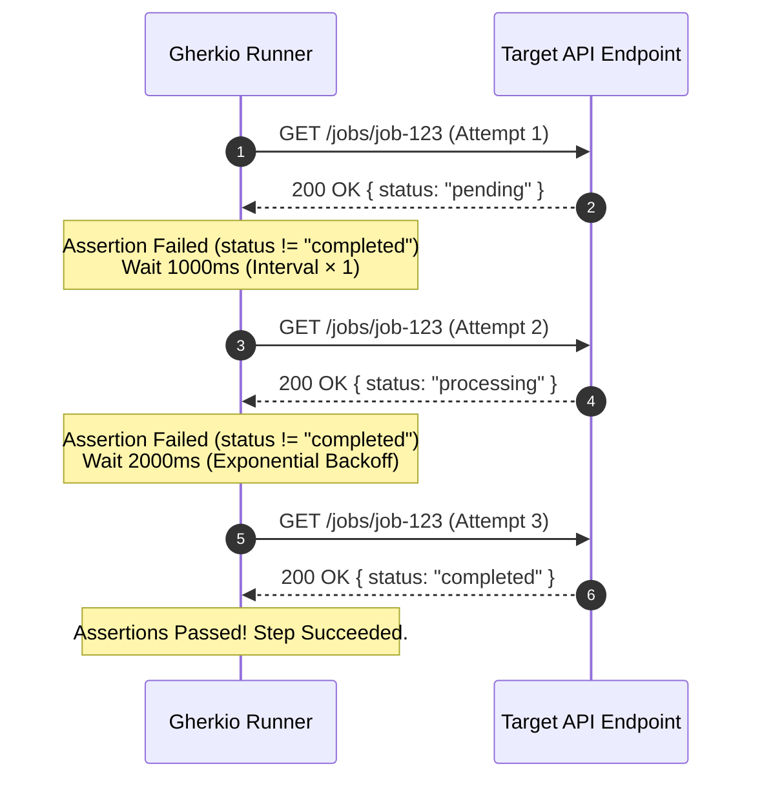

# Retry & Polling

In modern microservice and serverless systems, APIs are frequently eventually consistent. Gherkio offers native, step-level `retry` configurations to pull and assert against resources over time without writing custom loops.

---

## 🔁 Retry Key Reference

| Key | Type | Default | Description | Example |
| :--- | :--- | :--- | :--- | :--- |
| `attempts` | `integer` | `1` | Maximum number of retry attempts to perform | `attempts: 5` |
| `interval` | `integer` | `500` | Wait duration between retries, in milliseconds | `interval: 1000` |
| `backoff` | `string` | `constant` | Backoff strategy: `constant`, `linear`, or `exponential` | `backoff: exponential` |
| `maxDuration` | `string` | _(none)_ | Hard time cap for the entire retry loop (e.g. `15s`, `30s`, `1m`) | `maxDuration: 30s` |
| `onStatus` | `[]integer` | _(all)_ | Only retry when the response has one of these HTTP status codes | `onStatus: [404, 202]` |

### Backoff Strategies

Each strategy applies ±25% random jitter to prevent thundering herd problems on your backend servers:

| Strategy | Formula | Example (`interval: 1000`) |
| :--- | :--- | :--- |
| `constant` | `interval × jitter` | 1st: ~1000ms, 2nd: ~1000ms, 3rd: ~1000ms |
| `linear` | `interval × attempt × jitter` | 1st: ~1000ms, 2nd: ~2000ms, 3rd: ~3000ms |
| `exponential` | `interval × 2^(attempt-1) × jitter` | 1st: ~1000ms, 2nd: ~2000ms, 3rd: ~4000ms |

#### 📊 Backoff Strategy Timelines (`interval: 1000ms`)

```
1. CONSTANT BACKOFF (Fixed interval between retries)
Attempt 1      Attempt 2      Attempt 3      Attempt 4      Attempt 5
   |--------------|--------------|--------------|--------------|--------------|
   [0s]          [1s]           [2s]           [3s]           [4s]           [5s]
                (1.0s)         (1.0s)         (1.0s)         (1.0s)

2. LINEAR BACKOFF (Interval increases linearly: 1s, 2s, 3s, 4s...)
Attempt 1      Attempt 2           Attempt 3                Attempt 4
   |--------------|-------------------|------------------------|-----------------------------|
   [0s]          [1s]                [3s]                     [6s]                          [10s]
                (1.0s)              (2.0s)                   (3.0s)

3. EXPONENTIAL BACKOFF (Interval doubles each attempt: 1s, 2s, 4s, 8s...)
Attempt 1      Attempt 2           Attempt 3                Attempt 4
   |--------------|-------------------|------------------------|-----------------------------------|
   [0s]          [1s]                [3s]                     [7s]                               [15s]
                (1.0s)              (2.0s)                   (4.0s)
```

#### 🔄 Retry Loop Execution Sequence



---


## ⚡ Eventually Consistent Polling Pattern

If a background job processes an asynchronous action (e.g. video processing or payment settlement), the status endpoint initially returns `pending`. We want to poll this endpoint until the status is `completed` or our retry limit is exceeded.

```yaml
steps:
  - request:
      method: POST
      url: /jobs
      body: { type: "compress-video" }
    save:
      jobId: body.id

  - request:
      method: GET
      url: /jobs/$jobId
    retry:
      attempts: 10
      interval: 1000              # milliseconds
      backoff: exponential        # 1s, 2s, 4s, 8s... with ±25% jitter
      maxDuration: 30s            # hard stop after 30 seconds total
    expect:
      status: 200
      body.status: completed      # Retries until this assertion succeeds!
```

### Retrying on Specific Status Codes

Use `onStatus` to only retry when the server returns a particular status. This avoids wasting retries on unrecoverable errors (like `400` or `403`):

```yaml
  - request:
      method: POST
      url: /v1/tickets
      body:
        issue_tag_id: $issueTags[${randomInt(0,9)}].id
    retry:
      attempts: 5
      interval: 300
      backoff: constant
      onStatus: [409]             # Only retry on conflict — other errors fail immediately
    expect:
      status: 201
```

---

### How Retries Work Under the Hood:
1. Gherkio executes the HTTP request.
2. It validates the response against the `expect` block.
3. If all assertions succeed, the step completes immediately.
4. If **any** assertion fails, Gherkio checks `onStatus` (if set) — if the status code isn't in the list, it stops immediately without retrying.
5. Otherwise, it waits for `interval` ms (adjusted by the backoff strategy with jitter), re-injects fresh built-in variables (new `$uuid`, `$randomInt`, etc.), re-interpolates the request, and re-executes.
6. If `maxDuration` is set and the total elapsed time exceeds it, the retry loop aborts.
7. If the maximum `attempts` threshold is reached and assertions are still failing, the step fails, halting the scenario.
