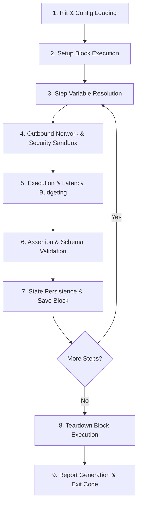

# What Happens in a Test: Execution Lifecycle

Understanding how Gherkio executes a test scenario is crucial for writing reliable API integration tests and debugging failures. Unlike imperative test frameworks that execute arbitrary code, Gherkio follows a **deterministic, multi-phase execution pipeline** built in static Go.

This guide details every internal step Gherkio takes from the moment you run `gherkio run` until the final report is generated.

---

## 📊 Overview: The Execution Pipeline

When Gherkio runs a test scenario, it processes the YAML definition through **9 distinct lifecycle phases**:



---

## 🔍 Phase-by-Phase Breakdown

### Phase 1: Initialization & Environment Context Resolution
Before executing any network calls, Gherkio loads workspace context from the `.gherkio/` directory:
1. **Reads Configuration (`.gherkio/config.yaml`)**: Loads project paths, report settings, masking, sandboxing, and multipart asset settings.
2. **Loads Environment Overrides (`.gherkio/environments/<env>.yaml`)**: Maps base URLs and service endpoints (e.g., `baseUrl: https://api.staging.example.com`).
3. **Injects Credentials (`.gherkio/credentials/<env>.yaml`)**: Injects user accounts and API keys into the `$accounts.<name>.<field>` variable scope. Sensitive values are marked for automatic console masking.
4. **Scenario Parsing**: Parses the selected YAML scenario. Run `gherkio validate` separately when you want full static validation before execution.

---

### Phase 2: Setup Block Execution (`setup`)
If your scenario defines a `setup` block, Gherkio executes these steps **first**, before the main `steps` sequence:
* **Purpose**: Seed test database, authenticate admin users, or create prerequisite resources.
* **Failure Rule**: If setup fails, the main `steps` block is skipped and execution proceeds to `teardown`.

```yaml
setup:
  - request:
      method: POST
      url: /admin/reset-db
    expect:
      status: 200
```

---

### Phase 3: Step Compilation & Variable Resolution
For each step in the `steps` array, Gherkio dynamically compiles the HTTP request right before dispatching:
1. **Generator Evaluation**: Dynamic variables like `$randomEmail`, `$uuid`, or `$timestamp` are evaluated to produce fresh runtime values.
2. **Context Substitution**: Placeholders in URL paths, headers, query parameters, and request bodies are replaced:
   * `$accounts.admin.token` → retrieved from credential store.
   * `$1-userId` → retrieved when a variable with that explicit name exists.
3. **Headers & Body Serialization**: Formats payloads as JSON or multipart form data based on request configuration.

---

### Phase 4: Network Execution & Outbound Security Sandboxing
Gherkio passes the compiled HTTP request to its HTTP client engine:
* **SSRF Protection**: Evaluates destination IP addresses against local subnet blocklists to prevent unintended internal network scanning in CI environments.
* **HTTP Wire Dispatch**: Opens TCP connection and transmits payload over HTTP/1.1 or HTTP/2.

---

### Phase 5: Latency Budgeting & Timing Measurement
Simultaneously with wire execution, Gherkio's high-precision timing engine measures response performance:
* Records exact latency in milliseconds (`durationMs`).
* Evaluates configured timing budgets (e.g., `timing: { max: 200ms }`).
* If response latency exceeds budget, the step is flagged with a timing violation.

---

### Phase 6: Response Assertions & Validation
Once the HTTP response arrives, Gherkio evaluates all defined expectations in sequence:

1. **Status Code Assertion**: Compares actual status code against expected (`expect.status`).
2. **Header Assertions**: Verifies required headers (`Content-Type`, `Cache-Control`).
3. **Body Value Matchers**: Evaluates exact values and supported matchers such as `contains`, `startsWith`, `endsWith`, `regex`, `oneOf`, `in`, `gt`, `gte`, `lt`, `lte`, `exists`, and type/format matchers.
4. **JWT Assertions**: Auto-decodes a discovered JWT and exposes claims through paths such as `jwt.sub` and `jwt.role`.
5. **JSON Schema Matching**: Validates full response body against `.gherkio/schemas/<schema-name>.yaml`.
6. **Redis Assertions**: A separate `redis:` step exposes `redis.exists`, `redis.value`, and `redis.ttl` to the same assertion engine.

```yaml
expect:
  status: 200
  body.user.role: oneOf admin,manager
  body.token: exists
  schema: user-profile
```

---

### Phase 7: State Persistence & Save Block
When assertions succeed, Gherkio extracts specified response values and stores them in the scenario runtime context:
* **Explicit Names**: The key written under `save:` is the variable name. Names such as `1-userId` are supported when explicit step-oriented naming is useful.
* **Cross-Step Propagation**: Subsequent steps can immediately reference saved values such as `$userId` in URLs, headers, or payloads.

```yaml
save:
  authToken: body.access_token
  createdUserId: body.user.id
```

---

### Phase 8: Teardown Block Execution (`teardown`)
Whether the scenario passes or fails, Gherkio guarantees execution of the `teardown` block:
* **Purpose**: Delete temporary resources, revoke temporary tokens, or clear test data.
* **Resilience**: Runs even if an intermediate step threw an error, preventing test pollution in shared environments.

```yaml
teardown:
  - request:
      method: DELETE
      url: /users/$createdUserId
      headers:
        Authorization: Bearer $adminToken
```

---

### Phase 9: Reporting & Output Generation
Finally, Gherkio aggregates all step timing, assertions, and payloads into output reports:
* **Console Terminal**: Outputs colored ANSI tree view with pass/fail badges, latency indicators, and masked sensitive data.
* **Report Artifacts**: Use `--report html`, `--report json`, or `--report html,json`. Output paths and retention are configured under `reports:` in `.gherkio/config.yaml`.

---

## 🎯 Example Execution Trace

Here is what happens step-by-step when executing a simple 2-step authentication scenario:

```
[00:00.000] 🟢 INIT     Loading environment 'staging' from .gherkio/environments/staging.yaml
[00:00.005] 🟢 RESOLVE  Interpolated $accounts.user1.email -> "testuser@example.com"
[00:00.010] 🚀 STEP 1   POST https://api.staging.example.com/v1/login
[00:00.145] 📥 RES 200  Received response in 135ms
[00:00.148] 🎯 ASSERT   status == 200 (PASS)
[00:00.150] 🎯 ASSERT   body.token exists (PASS)
[00:00.152] 💾 SAVE     Saved $1-jwt = "eyJhbGciOi..."
[00:00.155] 🚀 STEP 2   GET https://api.staging.example.com/v1/profile
                        Header 'Authorization' -> 'Bearer eyJhbGciOi...'
[00:00.240] 📥 RES 200  Received response in 85ms
[00:00.242] 🎯 ASSERT   body.email == "testuser@example.com" (PASS)
[00:00.245] ✅ SUMMARY  Scenario 'User Login Flow' PASSED (2 steps, 230ms total)
```

---

## 💡 Summary of Execution Rules

| Feature | Behavior |
| :--- | :--- |
| **Failure behavior** | Remaining steps continue by default; a failed setup skips the main block. Teardown still runs. |
| **Variable Scoping** | Saved variables persist throughout the scenario run; reset on new scenario. |
| **Teardown Guarantee** | `teardown` block executes regardless of scenario pass/fail outcome. |
| **Credential Safety** | Values from `$accounts` are automatically sanitized and redacted in logs. |
