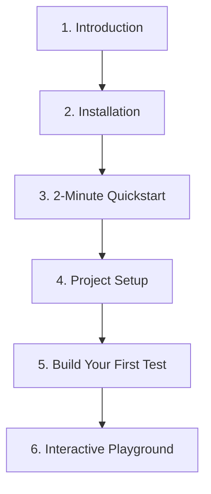

# Getting Started with Gherkio

Welcome to Gherkio! This guide is structured to take you from a complete beginner to writing and orchestrating advanced declarative integration tests in minutes.

---

## 🗺️ Progressive Onboarding Journey

To get the most out of Gherkio, follow this recommended step-by-step onboarding roadmap:

1.  **[Installation](installation.md)**: Compile from source or fetch compiled binaries for Linux, macOS, or Windows.
2.  **[2-Minute Quickstart](quickstart.md)**: Scaffold a testing sandbox with `gherkio init` and execute your first local test scenario.
3.  **[Project & Folder Setup](project-setup.md)**: Master Gherkio's folder layout, configuration overrides, and environments.
4.  **[Tutorial: Build Your First Test](first-test-tutorial.md)**: A hands-on walkthrough guiding you from an empty file to a multi-step variable-injecting test flow.
5.  **[Interactive Browser Playground](playground.md)**: Visualize YAML steps and translate legacy cURL statements instantly in your browser.

---

## 💡 Why Gherkio?

Traditional API integration testing requires writing hundreds of lines of boilerplate code in Javascript, Go, Python, or Java. This code quickly becomes unmaintainable, suffers from runtime syntax errors, and is difficult for non-engineers (like Product Managers or QA specialists) to read.

Gherkio solves this by introducing a **Declarative YAML Domain Specific Language (DSL)**:

| Feature | Gherkio (Declarative YAML) | Traditional Code (Imperative) |
| :--- | :--- | :--- |
| **Readability** | 🟢 Extremely high. Reads like a technical spec. | 🔴 Low. Hidden under imports, async blocks, and classes. |
| **Maintenance** | 🟢 No compiling or dependency management. | 🔴 Constant node/go module security updates. |
| **API Assertions** | 🟢 Zero-boilerplate `body.role: admin` | 🔴 Bulky `expect(res.body.role).to.equal("admin")` |
| **AI Generation** | 🟢 Near-perfect accuracy due to strict schema rules. | 🔴 Prone to syntax hallucinations, imports, and compiler issues. |

---

## ⚡ Core Concepts to Remember

As you read the documentation, keep these three structural pillars in mind:
- **Scenarios**: A scenario is a list of sequential HTTP request steps representing a user journey (e.g. *Login ➔ Create Cart ➔ Checkout*).
- **Environments**: Define your target base hosts (e.g. `https://api.staging.company.com`) without hardcoding them in test files.
- **Variables**: Save response fields dynamically (`save: authToken: body.token`) and reuse them in subsequent headers or bodies (`Authorization: Bearer ${authToken}`).

---

## 🎯 Gherkio Philosophy

Gherkio is built on a simple, uncompromising core principle:

> **Integration testing should describe *what* behavior to orchestrate, not *how* to implement it.**

*   **Declarative-First**: Scenarios describe high-level API workflows rather than writing custom test scripts or boilerplate code.
*   **Readability Matters**: Integration tests are written to be easily read, audited, and maintained by anyone on the team after 1–2 years.
*   **Deep Observability**: Every execution outputs structured, high-precision payloads and validation tracebacks so failures are debugged instantly.
*   **Constrained DSL**: No arbitrary coding loops or complex branching inside test files—forcing tests to stay clean, predictable, and robust.
