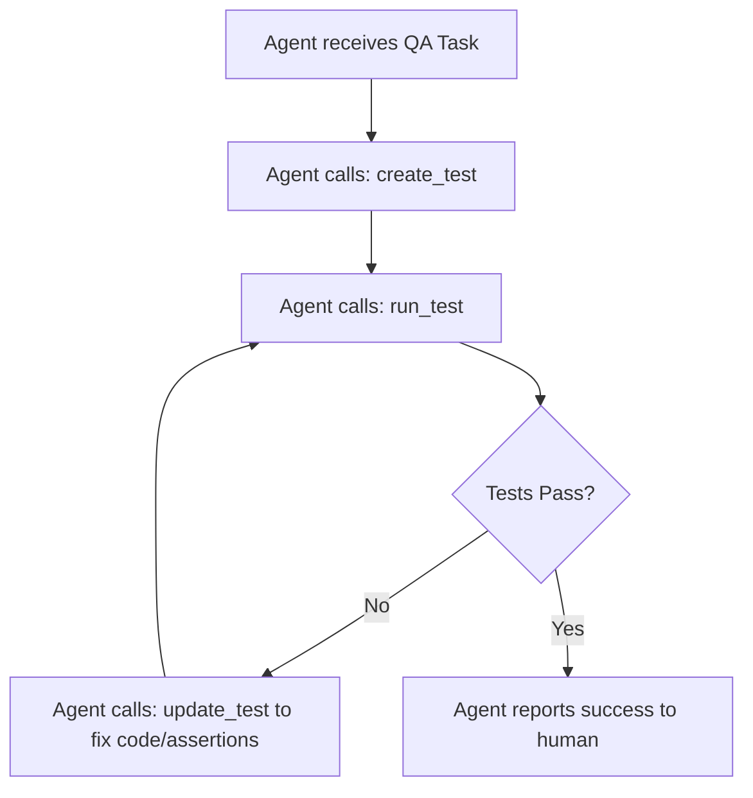

# LLM Integration & AI Agents

Gherkio was built from the ground up to be **AI-native**. Its flat, descriptive, YAML-based Domain Specific Language (DSL) and standard Model Context Protocol (MCP) server make it exceptionally easy for LLMs (such as Gemini, Claude, or GPT) to write, parse, and execute integration tests.

This chapter outlines best practices for prompting AI models to build tests, and integrating Gherkio with agentic workflows.

---

## 🤖 Prompting LLMs for Test Generation

When asking an AI model to write or modify Gherkio tests, feed the model Gherkio's core grammar rules. Below is a highly optimized prompt template you can use:

```
You are an expert QA engineer specializing in Gherkio's declarative API testing framework.
Write a Gherkio YAML test scenario based on the following requirements:
- Target endpoint: POST /v1/checkout
- Request JSON Body: { "itemId": <uuid>, "quantity": <integer between 1 and 5> }
- Expected output: Status 201, return body.orderId as a UUID.
- Save body.orderId for subsequent steps.

Rules:
1. Use Gherkio's built-in generator $uuid for the itemId.
2. Use Gherkio's dynamic generator ${randomInt(1,5)} for the quantity.
3. Validate response status code and response type structures.
4. Always prefix any saved dynamic variables in the 'save' block with the step number (e.g. '1-createdOrderId' for step 1) to ensure strict cross-step traceability.
```

The AI model will output a flawless declarative schema matching Gherkio requirements:

```yaml
scenario: Complete Item Checkout
steps:
  - request:
      method: POST
      url: /v1/checkout
      body:
        itemId: $uuid
        quantity: ${randomInt(1,5)}
    expect:
      status: 201
      body.orderId: uuid
    save:
      1-createdOrderId: body.orderId
```

---

## 🔌 Using MCP Tools Effectively in Agent Workflows

In agentic environments (such as Claude Desktop, Cursor, or specialized coder loops), Gherkio's MCP server empowers the model to run a complete, sandboxed test execution loop:



### ⚡ Recommended Agent Operations

1. **Static Analysis Pre-check**: Prior to writing a test to disk, agents should utilize the `validate_test` tool. This ensures the YAML syntax is valid and all referenced custom assertion schemas are properly mapped, preventing run-time parser crashes.
2. **Step-Isolated Executions**: For large end-to-end user journeys (e.g. 10 steps), running the entire scenario takes time. Agents can debug issues by isolating a single step using the `step` parameter in `run_test`:
   ```json
   {
     "name": "run_test",
     "arguments": {
       "path": "tests/e2e/checkout.yaml",
       "step": 4
     }
   }
   ```
3. **Automatic cURL Conversion**: When importing external manual tests, agents can translate curl logs directly into Gherkio step structures by calling `convert_curl_to_yaml`.
