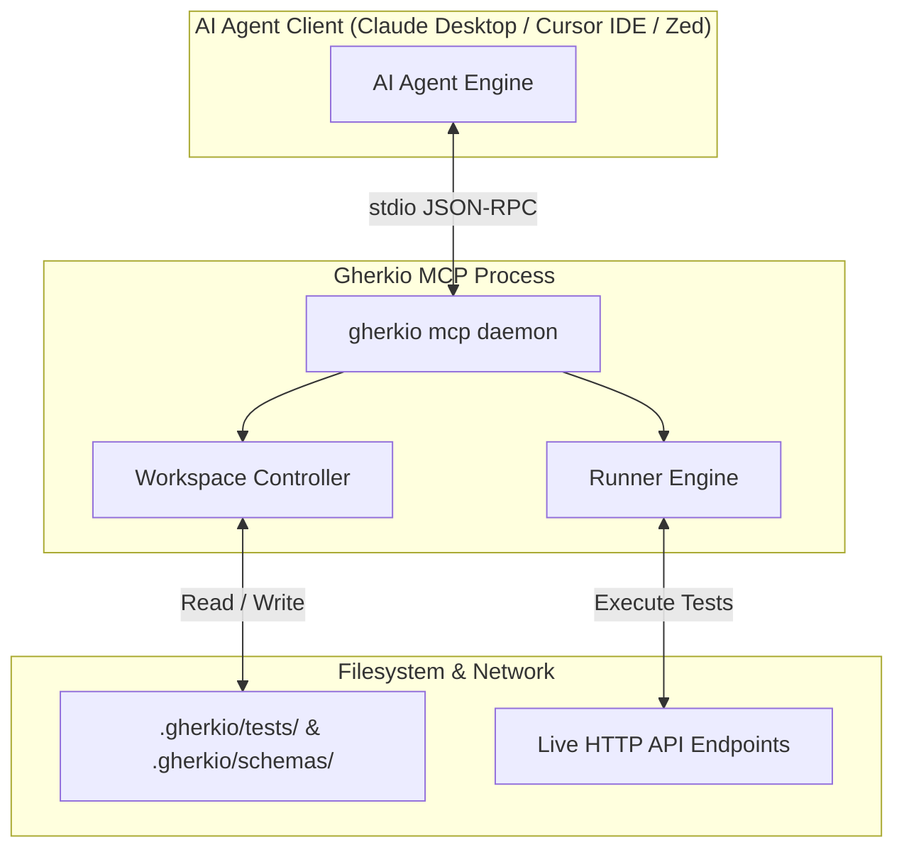

# Model Context Protocol (MCP) Server

Gherkio features native, built-in support for the **Model Context Protocol (MCP)**, a standard JSON-RPC protocol initiated by Anthropic that allows AI models (like Gemini, Claude, or GPT) to interact securely and productively with local tools and files.

By running an MCP server, Gherkio enables AI agents to plan, write, validate, execute, and debug integration tests entirely in the background, transforming Gherkio from a simple CLI tool into an autonomous AI QA coworker.

---

## 🧭 Why Gherkio Integrates MCP

Without MCP, an AI assistant operates blindly inside your project:
- It doesn't know Gherkio's exact DSL grammar, available matchers, or configuration layouts, leading to syntax halluncinations.
- It cannot execute HTTP calls to verify if a test passes or fails.
- It cannot read environment and credential configurations to perform role-based checking.

With Gherkio's MCP server active, the AI assistant receives:
1. **Dynamic Tools (Capabilities)**: Can initialize workspaces, create/update test files, run tests in isolation, and perform static analysis checks.
2. **Native Resources**: Read-only access to Gherkio's DSL specification, autocomplete JSON schemas, and canonical syntax examples.

---

## 🔌 Architecture & Connection Transport

Gherkio's MCP server uses a standardized **stdio (standard input/output)** connection transport. 

When your editor (e.g. Cursor, VS Code, Zed) or AI desktop client (Claude Desktop) starts Gherkio, it launches a persistent background process:

---

## ⚡ Client Integrations

Gherkio can be plugged directly into all major AI IDEs and clients. See the **[Setup Guide](setup.md)** for detailed configuration blocks for:
- Claude Desktop
- Cursor IDE
- VS Code (via Roo Code / Continue)
- Zed Editor
