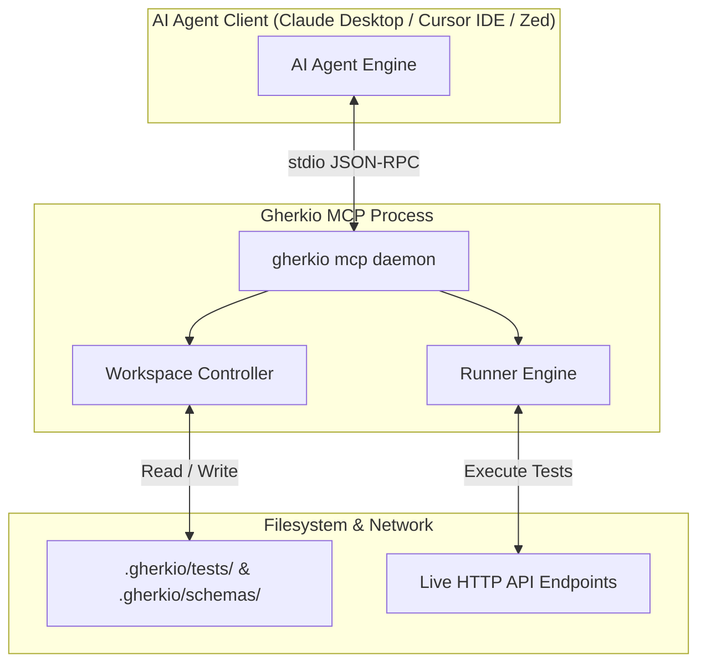

# Model Context Protocol (MCP) Server

> 🔴 **Expert & Platform Engineering Guide** — Gherkio features native, built-in support for the **Model Context Protocol (MCP)**, a standard JSON-RPC protocol initiated by Anthropic that allows AI models (like Gemini, Claude, or GPT) to interact securely and productively with local tools and files.

By running an MCP server, Gherkio enables AI agents to plan, write, validate, execute, and debug integration tests entirely in the background, transforming Gherkio from a simple CLI tool into an autonomous AI QA coworker.

---

## 🧭 Why Gherkio Integrates MCP

Without MCP, an AI assistant operates blindly inside your project:
- It doesn't know Gherkio's exact DSL grammar, available matchers, or configuration layouts, leading to syntax hallucinations.
- It cannot execute HTTP calls to verify if a test passes or fails.
- It cannot read environment and credential configurations to perform role-based checking.

With Gherkio's MCP server active, the AI assistant receives:
1. **Dynamic Tools**: Can initialize workspaces, create/update test files, run tests in dry-run or real execution mode, and perform static analysis checks.
2. **Native Resources**: Read-only access to Gherkio's DSL specification, autocomplete JSON schemas, and canonical syntax examples.

---

## 🔌 Architecture & Connection Transport

Gherkio's MCP server uses a standardized **stdio (standard input/output)** connection transport. 

When your editor (e.g. Cursor, VS Code, Zed) or AI desktop client (Claude Desktop) starts Gherkio, it launches a persistent background process:

---

## 🛠️ MCP Tools & Capabilities

The Gherkio MCP server exposes 25+ structured tools to the AI assistant:

| Tool Category | Key Tools | Purpose |
| :--- | :--- | :--- |
| **Workspace & Config** | `mcp_gherkio_init_project`, `get_config`, `get_environment_context` | Discover active project structure, target environments, and credentials. |
| **Scenario Management** | `create_test`, `read_test`, `update_test`, `delete_test`, `list_tests` | Author and edit YAML test files in `.gherkio/tests/`. |
| **cURL Conversion** | `convert_curl_to_yaml`, `convert_yaml_to_curl` | Convert raw cURL terminal commands into Gherkio DSL scenarios. |
| **Validation & Dry-Run** | `validate_test`, `validate_workspace` | Perform static analysis to detect invalid matchers or missing variables. |
| **Execution Engine** | `run_test` (with `dryRun=true` or isolated `step` execution) | Execute scenarios in real-time and return detailed step traces. |

---

## ⚡ Client Integrations & Setup Guides

Connect Gherkio directly to your preferred AI developer tool:
* 🛠️ **[MCP Setup Guide](setup.md)**: Configuration snippets for Claude Desktop, Cursor IDE, VS Code, and Zed.
* 🧰 **[Tools Reference](tools.md)**: Exhaustive JSON-RPC payload and tool definitions.
* 📚 **[Resources Reference](resources.md)**: Accessing static DSL specs and autocomplete schemas.
* 🤖 **[LLM & AI Workflows](llm-integration.md)**: Prompting patterns for automated test generation and self-healing test runs.
