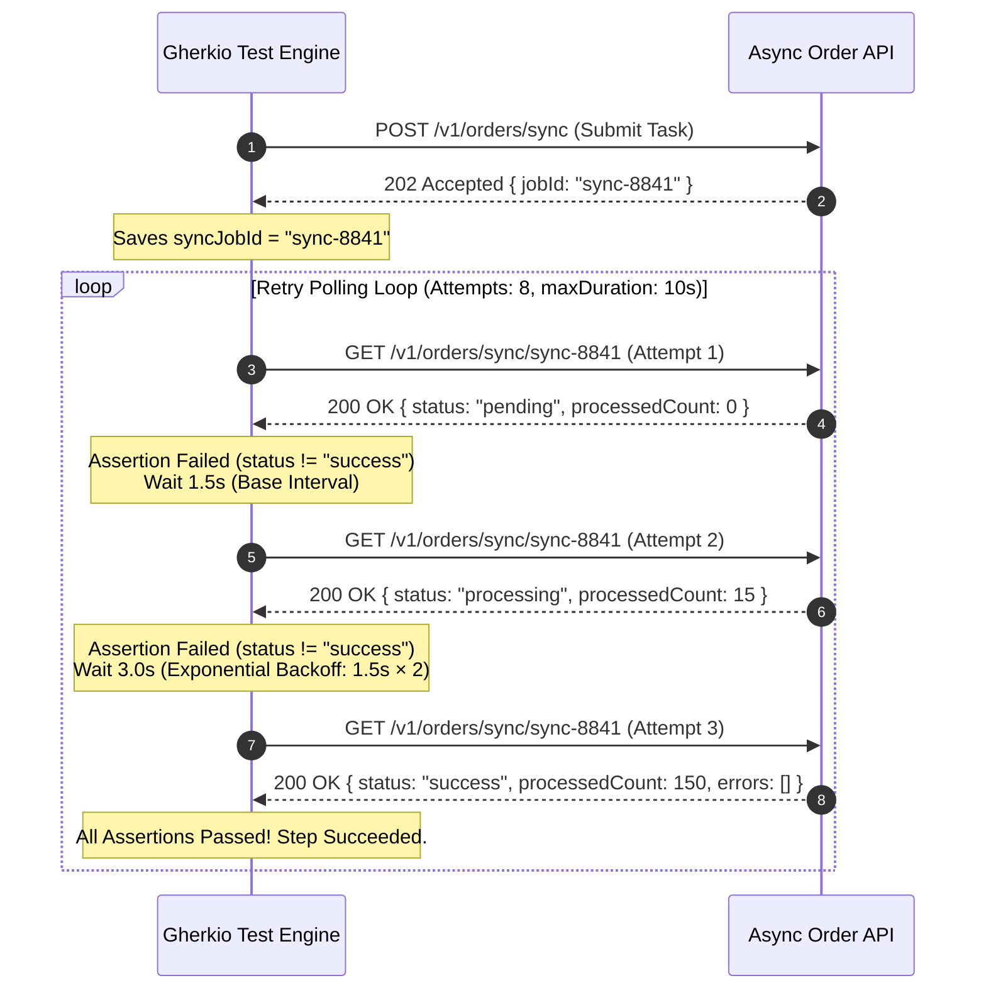

# Async Polling & Eventual Consistency

Verify asynchronous operations (such as data pipeline synchronization or long-running audio processing jobs) that require time to complete.

---

## 📝 The Scenario

```yaml
scenario: Async Order Sync Validation
tags:
  - async
  - orders

steps:
  # Step 1: Submit long-running order sync task
  - request:
      method: POST
      url: /v1/orders/sync
    expect:
      status: 202
      body.jobId: exists
    save:
      syncJobId: body.jobId

  # Step 2: Poll status endpoint with backoff until completed
  - request:
      method: GET
      url: /v1/orders/sync/$syncJobId
    retry:
      attempts: 8
      interval: 1500                 # Interval in milliseconds between retries
      backoff: exponential           # Backoff strategy: "linear" or "exponential"
      maxDuration: 10s               # Maximum total duration allowed for the retry loop
    expect:
      status: 200
      body.status: "success"
      body.processedCount: gt 0
      body.errors: empty
```

---

## 📊 Polling & Backoff Execution Visual Illustration

When Gherkio executes Step 2 with `interval: 1500` and `backoff: exponential`, the runner dynamically adjusts the wait duration between consecutive requests:

```
Attempt 1 (0s) ──[ Wait 1.5s ]──> Attempt 2 (1.5s) ──[ Wait 3.0s ]──> Attempt 3 (4.5s) ──[ Wait 6.0s ]──> (Passes or hits maxDuration 10s)
```



---

## 💡 Key Design Patterns Used

1. **Wait State Separation**: Spares resources by avoiding hardcoded sleep scripts, utilizing declarative interval timers.
2. **Backoff Escalation**: Exponentially increases interval duration (1.5s ➔ 3.0s ➔ 6.0s), giving slow-settling background tasks wider windows while finishing fast for quick jobs.
3. **Step Halting**: If the status remains non-successful after 8 attempts (or 10 seconds total), Gherkio halts the scenario and records a failure diagnostic snapshot.
