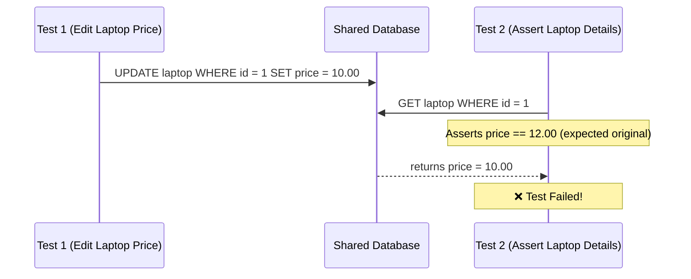

# Parallel Execution Best Practices

To accelerate CI feedback loops, Gherkio supports multi-threaded, parallel test executions. However, running integration tests concurrently requires careful state separation.

---

## ⚡ Running Parallel Tests from the CLI

Run a directory of tests with custom concurrency levels using the `--parallel` (or `-p`) flag:

```bash
# Run tests with 4 parallel execution threads
gherkio run .gherkio/tests/ -p 4
```

---

## ⚠️ The Concurrent Mutation Problem

If multiple tests manipulate the exact same shared DB entity, race conditions will occur:



---

## 🛡️ Key Safety Strategies

### 1. Isolated Dynamic Data
Avoid hardcoding entity identifiers or emails. Utilize Gherkio's dynamic generators to create unique resources per test thread:

```yaml
steps:
  - request:
      method: POST
      url: /v1/users
      body:
        email: $randomEmail         # Unique email per thread!
        name: "Test User"
```

### 2. Microservice Routing Isolation
If your microservices support multi-tenant isolation, inject tenancy headers:

```yaml
steps:
  - request:
      method: GET
      url: /v1/products
      headers:
        X-Tenant-ID: "tenant-${uuid}"  # Dynamic tenant separation
```
