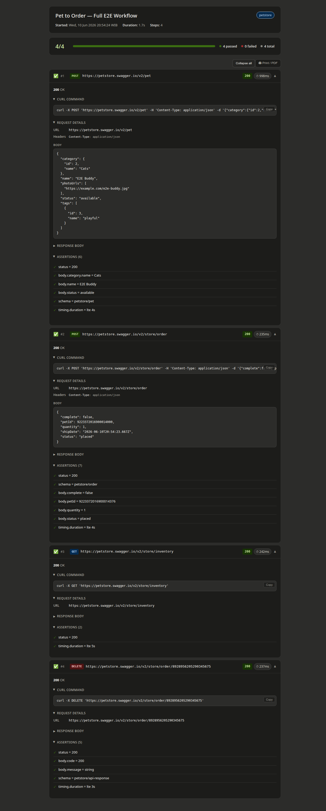

# Test Reports & Run Results

Gherkio produces structured output in two forms: **console output** (immediate, ephemeral) and **saved reports** (persistent, shareable).

---

## Console Output

When you run `gherkio run`, each step is printed to stdout with its result:

```
✓ POST https://dummyjson.com/auth/login
  ✓ status = 200
  ✓ body.exists = true
  ✓ body.username = emilys
  Duration: 312ms

✓ GET https://dummyjson.com/users/1
  ✓ status = 200
  ✓ body.id = 1
  Duration: 89ms

✓ PASS
2 passed, 0 failed, 2 total
Duration: 401ms
```

### Pass/Fail Indicators

| Symbol | Meaning |
|--------|---------|
| `✓` | Step or assertion passed |
| `✗` | Step or assertion failed |
| `→` | Redirected (HTTP 3xx) |

### Failure Output

When a step fails, Gherkio prints the failed assertion details plus the full response:

```
✗ POST https://petstore.swagger.io/v2/pet/1
  ✗ status = 200 (expected), got 404
  ✗ body.id exists (path not found)

Available fields:
  - message
  - statusCode

Response:
Status: 404

Body:
{
  "message": "Pet not found"
}
```

Gherkio also extracts available JSON fields when a path is not found, so you can quickly correct your assertion path.

### Verbose Output

Use `--verbose` to show full request and response bodies:

```bash
gherkio run tests/login.yaml --verbose
```

Sensitive fields (password, token, secret, creditCard, etc.) are always masked in console output.

---

## Saved Reports

Reports are generated only when you add the `--report` flag:

```bash
gherkio run tests/login.yaml --report html          # HTML report
gherkio run tests/login.yaml --report json          # JSON report
gherkio run tests/login.yaml --report html,json     # Both formats
```

### Report Directory Structure

Reports are saved under `.gherkio/reports/`:

```
.gherkio/reports/
├── latest/                           # most recent run (overwritten each time)
│   ├── report.html
│   └── report.json
├── 20260610_143052/                 # timestamped copy
│   ├── report.html
│   └── report.json
└── failures/                         # individual failed step snapshots
    └── failure-<Scenario>-<StepName>-step<N>-<timestamp>.json
```

The `latest/` directory is always overwritten with the most recent run. Timestamp directories preserve historical runs indefinitely (no automatic cleanup by default).

### HTML Report

The HTML report is a self-contained file with **no external dependencies** - all CSS and JavaScript are inlined. Open it in any browser.

**Example:** An actual HTML report from the petstore test suite looks like this (open `.gherkio/reports/latest/report.html` in your browser to explore it interactively):



**Features:**
- Dark/light mode via CSS media query
- Expandable step sections (collapsed by default, failed steps auto-expand)
- Pass/fail badges per step with HTTP status code coloring
- Response time badge on each step (turns red if a timing.max assertion failed)
- Copyable cURL command per step (reproduce the exact request in your terminal)
- Copyable request ID badge (if the server returns x-request-id or similar headers)
- Expand All / Collapse All toolbar toggle
- Sensitive values masked automatically

### JSON Report

The JSON report is machine-readable and ideal for CI/CD pipelines, historical analysis, or custom dashboards.

**Report structure:**

```json
{
  "metadata": {
    "version": "1.0.0",
    "timestamp": "2026-06-10T14:30:00Z",
    "duration": 401,
    "scenario": "login example",
    "testFile": "tests/auth/login.yaml",
    "environment": "local"
  },
  "summary": {
    "total": 2,
    "passed": 2,
    "failed": 0,
    "passedPercent": 100
  },
  "steps": [
    {
      "index": 0,
      "label": "POST https://dummyjson.com/auth/login",
      "duration": 312,
      "durationLabel": "312ms",
      "passed": true,
      "curl": "curl -X POST 'https://dummyjson.com/auth/login' -H 'Content-Type: application/json' -d '{"username":"emilys","password":"***masked***"}'",
      "request": {
        "method": "POST",
        "url": "https://dummyjson.com/auth/login",
        "headers": { "Content-Type": "application/json" },
        "body": { "username": "emilys", "password": "***masked***" }
      },
      "response": {
        "status": 200,
        "headers": { "Content-Type": "application/json", "x-request-id": "req_abc123" },
        "body": { "accessToken": "***masked***", "username": "emilys", "id": 1 }
      },
      "requestId": "req_abc123",
      "assertions": [
        { "path": "status", "expected": "200", "actual": "200", "passed": true },
        { "path": "body.accessToken", "expected": "exists", "actual": "***masked***", "passed": true }
      ]
    }
  ],
  "errors": []
}
```

**Key fields per step:**

| Field | Description |
|-------|-------------|
| `duration` / `durationLabel` | Step duration in milliseconds and human-readable form |
| `curl` | Copy-pasteable cURL command with sensitive values masked |
| `requestId` | Tracing ID extracted from response headers (x-request-id, x-trace-id, request-id, etc.) |
| `assertions` | Each assertion with path, expected, actual, and pass/fail status |

### Raw Reports (Unmasked)

By default, sensitive values are masked in JSON reports. To generate an unmasked report:

```bash
gherkio run tests/login.yaml --report json --report-raw
```

The `--report-raw` flag only affects JSON reports. HTML reports and cURL commands always mask sensitive values regardless of this flag.

### Failure Snapshots

When a step fails, Gherkio also saves an individual JSON snapshot in `.gherkio/reports/failures/`:

```json
{
  "timestamp": "2026-05-31T03:17:41.744Z",
  "scenario": "Delete a Pet (DELETE)",
  "testFile": "tests/petstore/01-pet/05-delete-pet.yaml",
  "failedStepIndex": 0,
  "failedStepLine": 3,
  "role": "steps",
  "error": "assertion status failed: expected 200, got 404",
  "diagnostics": {
    "request": { "method": "DELETE", "url": "https://petstore.swagger.io/v2/pet/1", "headers": {}, "body": null },
    "response": { "statusCode": 404, "durationMs": 260, "headers": {...}, "body": null },
    "variableStoreAtFailure": { "randomEmail": "user_552580@example.com", ... }
  }
}
```

These snapshots capture the full request/response context at failure time, including the variable store state, making it easy to debug flaky or environment-specific failures.

---

## Configuration

Reports can be configured in `.gherkio/config.yaml`:

```yaml
reports:
  format: html        # default format when --report is omitted
  directory: reports  # directory under .gherkio/ (default: reports)
```

The `--report` CLI flag always overrides the config setting for a given run.

---

## CI/CD Integration

Use the JSON report for CI/CD ingestion:

```bash
gherkio run --report json --env ci

# Exit code 0 = all passed, exit code 1 = one or more failed
```

Parse the summary object for pass/fail counts:

```bash
cat .gherkio/reports/latest/report.json | jq .summary
# { "total": 4, "passed": 4, "failed": 0, "passedPercent": 100 }
```
